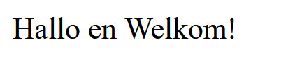

# PHP-BASIC - Webserver

## Taak 01 - Serveren van pagina's

## Uitleg

Elke website die jij bezoekt op het World Wide Web wordt getoond omdat het op een webserver geplaatst is. Zo'n webserver heeft een map met daarin HTML pagina's, submappen met CSS bestanden en eventueel Javascript bestanden.

Tot nu toe ben je gewend om de HTML-bestanden gewoon vanaf je eigen computer te starten door er dubbel op te klikken. De browser leest de bestanden en je ziet een mooie (of lelijke) pagina.

Je bent als gebruiker van webapplicaties gewend om bijvoorbeeld in te loggen, een bericht achter te laten of een email te sturen. Deze applicaties zijn _dynamisch_. Ze hebben een __input__ en een __output__.

Om een dynamische webapplicatie te gebruiken heb je echter een webserver nodig die de pagina's __serveert__. Net als een ober een drankje serveert.

Maar omdat je nog geen toegang hebt tot een echte webserver gaan we er eentje simuleren. We simuleren dat met een een gratis applicatie die je kunt installeren op je eigen laptop.

Om een dynamische applicatie te maken gaan we in de module gebruik maken van PHP.

PHP is een backendtaal. Een bezoeker van de site (de eindgebruiker) kan de code niet zien of wijzigen. Met PHP kun je ook een database benaderen waarin je gegevens kan opslaan voor een langere periode, bijvoorbeeld de gegevens van een gebruiker zoals voornaam, achternaam, email en wachtwoord.

Als je met PHP aan de slag gaat dan kun je pagina's dynamisch maken. Dit betekent dat de output afhankelijk is van de input van de gebruiker.

Tijdens deze module maak je gebruik van een locale server. Je kunt hiervoor Xampp gebruiken.

Je kunt Xampp downloaden en installeren

## Opdracht

### Windows gebruikers

1. [Download Xampp](https://www.apachefriends.org/download.html)

2. Installeer Xampp met het installatieprogramma.
   - Tip: installer deze op: C:\Xampp
3. Start Xampp
4. Open de map C:\Xampp\htdocs in VS Code
5. Clone of kopieer deze repository-map in zijn geheel daarheen.
6. Open deze taak in je browser door het volgende in te typen in de adresbalk: `http://localhost/php-basic/0-webserver/taak01`

## Eindresultaat

