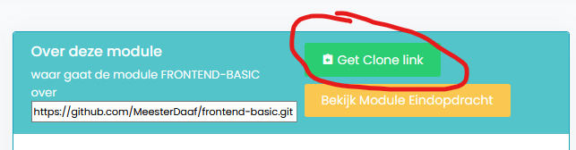

# FRONTEND-BASIC

## Cloning is easy-TAAK-01

### Introductie

### Definitie

Met behulp van GIT, github.com en jouw code skills ga je de mooiste dingen bouwen. Vaak werk je aan code dat al bestaat, soms begin je from scratch. Het gaat erom dat jij weet hoe je op jouw machine aan de slag kunt gaan. Je gaat het commando `git clone` gebruiken om een `repository` te __clonen__.

### Github.com

Op github.com staan tot nu toe alle door jou doorlopen modules. Kijk maar eens bij [github.com](https://github.com)

### Repositories

Je ziet op github.com repositories staan. Dit zijn stukjes code bij elkaar. Het kan een project zijn of een specifieke plugin of functionaliteit.
Een repository kun je downloaden naar je eigen computer, zodat je de code daar op kunt draaien, testen en aanpassen.

### Opdracht

Clone deze repository __Frontend-Basic__ van github.com door de volgende stappen te doen:

1. [ ] Ga naar de module FRONTEND BASIC in [EAGLEDEV](https://eagledev.nl)
2. [ ] Klik op de groene knop 
3. [ ] Open met VS CODE de map __Jaar1__ op je ONEDRIVE.
4. [ ] Open een terminal.
5. [ ] Dit moet je in de terminal krijgen:

    ```terminal
    git clone https://github.com/___USERNAME__/frontend-basic.git
    ```

6. [ ] en dat doe je door punt 7 uit te voeren:
7. [ ] Type het volgende in `git clone` en druk op CTRL+V
8. [ ] Als alles goed gegaan is dan heb je de hele repository (module) op je computer staan en kun je de opdrachten (taken gaan) maken
9. [ ] Ga maar eens naar de map/folder


<!--- ------------ DIT COMMENTAAR LATEN STAAN AUB ------------
------------------ ------------------------------ ------------
------------------ eagle ref:27134510
------------------ ------------------------------ ------------
------------------ DIT COMMENTAAR LATEN STAAN AUB -------- -->