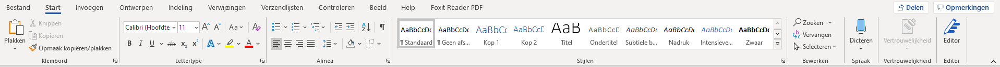

# FRONTEND-BASIC

## KIJKEN NAAR DESIGN-TAAK-05

### Websites bestaan uit blokken 4

### OPDRACHT

1. Download het programma MS Paint 3D.
2. Teken rechthoeken om alle blokken die jij kunt vinden in volgende 
3. Hoeveel blokken heb je kunnen vinden?

<!--- ------------ DIT COMMENTAAR LATEN STAAN AUB ------------
------------------ ------------------------------ ------------
------------------ eagle ref:77688930
------------------ ------------------------------ ------------
------------------ DIT COMMENTAAR LATEN STAAN AUB -------- -->
