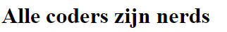
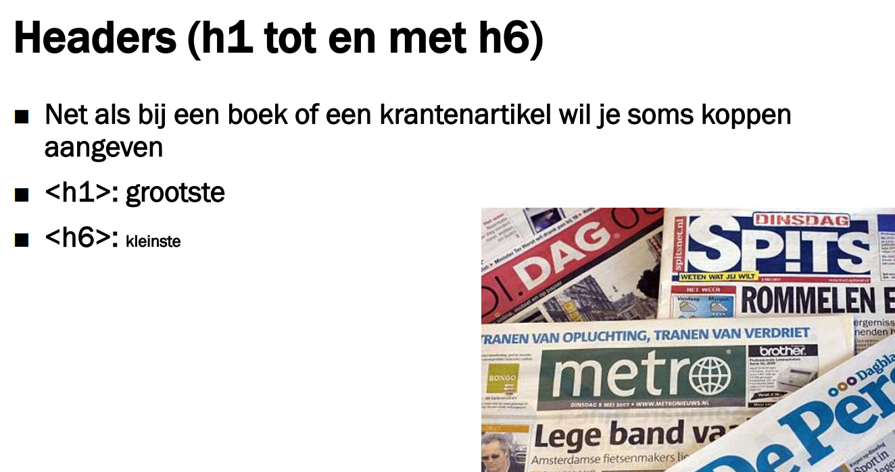

# FRONTEND-BASIC

## BASIS HTML-TAAK-03

### De juiste informatie tussen de tags

Bij de vorige taak maakte je kennis met HTML-tags. Ook spraken we over het plaatsen van informatie tussen de tags. Je zag ook dat er allerlei verschillende tags zijn. Enkele zijn ook toegelicht zoals, `<head>`, `<title>` en `<body>`.

Bij coderen is het heel belangrijk om je aan de standaardafspraken te houden. Wij zullen deze afspraken behandelen, in deze taak _Afspraak 1._

- __Afspraak 1:__ Zet de juiste informatie tussen de tags
- __Afspraak 2:__ Inspringen (indenting) is verplicht, dit zorgt voor leesbaarheid. Inspringen doe je met de TAB-toets.

### Afspraak 1

Zet de juiste informatie tussen de tags. Stel je wilt een artikel voor een webpagina maken. Dan gebruik je een kop en een paragraaf. De tekst van het artikel komt natuurlijk op de plek van de paragraaf. De titel komt dan natuurlijk op de plek van de kop.
Met HTMl ziet dat er zo uit:

```html
<!DOCTYPE html>
<html>
  <head>
    <title>Artikel over nerds</title>
  </head>
  <body>
    <h1>Alle coders zijn nerds</h1>
    <p>Sommige mensen zeggen dat nerds slimme mensen zijn, anderen zeggen dat nerds gewoon nieuwsgierige mensen zijn.</p>
  </body>
</html>
```

Je ziet dat de tekst `Alle coders zijn nerds` tussen de `<h1>` en `</h1>` staat. Dit betekent dat deze tekst groter en dikker getoond wordt.



Er bestaan nog meer kopteksten, ook wel headers genoemd.



`<h6>` is dus de kleinste kop.

Maar er zijn ook nog andere tags die veel gebruikt worden:

- `<div>` wordt gebruikt voor meerdere situaties en betekent _division_
- `<aside>` wordt gebruikt om een zijkant van een pagina aan te geven
- `<address>` wordt gebruikt om een adres aan te geven
- `<main>` wordt gebruikt om het belangrijkste deel van de zichtbare info aan te geven
- `<footer>` wordt gebruikt voor de onderkant

Er zijn er nog veel meer. Door te blijven coderen kom je er vanzelf achter welke er nog meer zijn.

### OPDRACHT

1. Maak bij deze taak gebruik van bestand: `index.html`
2. Maak 3 artikelen met ieder een andere koptekst-grootte
3. Maak daarbij gebruik van paragraaf `<p>` tags.
4. Omdat het om artikelen gaat zet je het geheel tussen `<article>` tags
5. Zet de onderstaande teksten op de juiste plek in de pagina

#### Artikel 1

- titel = 'Nieuwe patatzaak is geopend!'
- tekst = 'Een bijzondere patatzaak aan de Keizersgracht wordt morgen 20 oktober geopend.'

#### Artikel 2

- titel = 'Burgermeester Halsema houdt de (nacht)wacht'
- tekst = 'De Amsterdamse Burgemeester houdt wel van een biertje'

#### Artikel 3

- titel = 'Frenkie De Jong scoort drie keer'
- tekst = 'De Jong heeft een van zijn betere dagen afgelopen zondag gehad bij FC Barcelona, hij scoorde weer eens!'

### BRONNEN

- [W3Schools - HTML Tutorial](https://www.w3schools.com/html/)
- [HTML leren schrijven - Les 1](https://www.youtube.com/watch?v=3ejolTCFrYg)


<!--- ------------ DIT COMMENTAAR LATEN STAAN AUB ------------
------------------ ------------------------------ ------------
------------------ eagle ref:37058390
------------------ ------------------------------ ------------
------------------ DIT COMMENTAAR LATEN STAAN AUB -------- -->