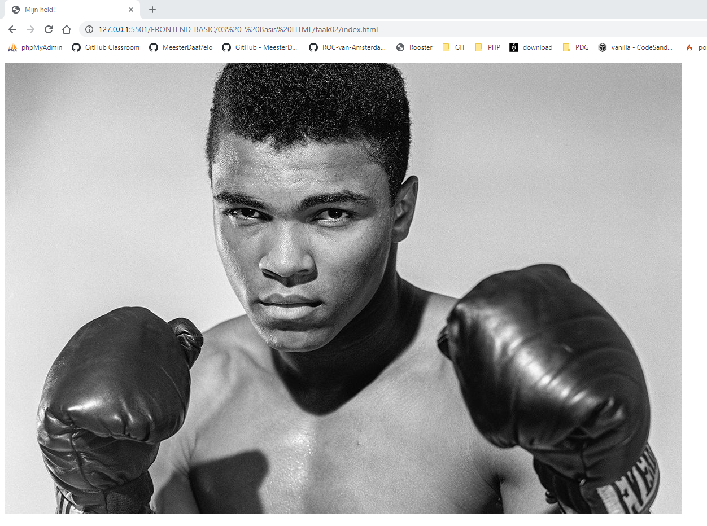

# FRONTEND-BASIC

## BASIS HTML-TAAK-05

### Plaatje toevoegen

Bij taak 1 kreeg je een introductie  over verschillende HTML-tags. We hadden het over `openings`- en `sluit`-tags. Tussen de tags zetten we de informatie. Bij een image-tag werkt het net even anders. Een image-tag `` heeft geen sluit-tag.

```html
<!DOCTYPE html>
<html>
  <head>
    <title>Hier komt de titel</title>
  </head>
  <body>
    Hier staat zichtbare informatie. De gebruiker kan dit lezen
    
  </body>
</html>
```

Soms wil je ook een plaatje toevoegen aan je website. Daarvoor gebruiken we de `` tag. Dit staat voor __image__ wat dus plaatje of foto betekent.

Deze `img`-tag heeft geen sluit-tag. Je zul vanzelf bekend worden met welke tag wel en welke niet een sluit-tag heeft. Door te gaan bouwen krijg je ervaring. Zo simpel is het.

Deze `img`-tag heeft wel een _attribuut_. Een attribuut is een eigenschap. Net als lichaamslengte en haarkleur een eigenschap is. Zo is `src` ook een eigenschap, van `img`.
`src` staat voor source ofwel bron. Wat is de bron van het plaatje? Wat is de lokatie van het plaatje? Dat zet je achter het `=`-teken tussen aanhalingstekens `"`.

> Als het plaatje __in dezelfde map staat__ als het html-bestand dan hoef je alleen de naam en de extentie van het plaatje op te geven.

* taak03 (map)
  * index.html
  * mijn_plaatje.jpg

>
> ```html
>
> >  
>
> ```

Je ziet in dit voorbeeld dat ook de extentie (bestandstype) wordt opgeschreven. Dit is verplicht bij het _attribuut_ `src`. Je codeert eigenlijk alles zo specifiek en nauwkeurig mogelijk. Daarnaast staat de naam van het plaatje en de extentie tussen aanhalingstekens. Dit doe je voor alle attributen van een HTML-tags

> Opmerking: Alle zichtbare elementen, en dus ook een plaatje, plaats je altijd tussen de `<body>`-tags

### OPDRACHT

1. Maak bij deze taak gebruik van het bestand van taak01: `index.html`
2. Download een plaatje of afbeelding die je gaaf vindt.
3. Zet dit plaatje in de map van deze taak
4. Codeer met de `img` tag het plaatje zichtbaar op de webpagina.

### EINDRESULTAAT



### BRONNEN

* [W3Schools - HTML Tutorial](https://www.w3schools.com/html/)


<!--- ------------ DIT COMMENTAAR LATEN STAAN AUB ------------
------------------ ------------------------------ ------------
------------------ eagle ref:25703834
------------------ ------------------------------ ------------
------------------ DIT COMMENTAAR LATEN STAAN AUB -------- -->