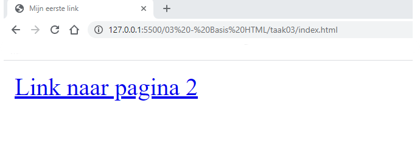
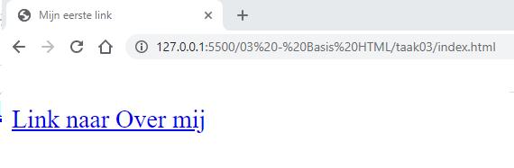

# FRONTEND-BASIC

## BASIS HTML-TAAK-06

### Links maken

Oké, je hebt nu een taak gedaan met een basispagina en een taak waarbij je een plaatje invoegt in je pagina.
In deze taak gaan we twee webpagina's aan elkaar linken.

Het gehele online web bestaat uit links. Als je ergens op klikt dan klik je op een URL-link. (Uniform Resource Locator).
Een link wordt ook wel een `anchor-tag` genoemd. Een anker of een haakje. Een haakje naar iets anders toe.

Een link heeft ook een _attribuut_, net als bij `` waarbij `src` gebruikt werd, heeft een anchor-tag `<a>` een `href` attribuut.

Bij `href` zet je de lokatie van een pagina neer, voorbeelden zijn:

- `https://www.rocva.nl`
- `https://www.eagledev.nl`
- `https://www.outlook.com`

Maar ook

- link_naar_andere_pagina.html
- tweede_pagina.html

Al deze `url`s staan tussen aanhalingstekens, net als bij ``

```html
<!DOCTYPE html>
<html>
  <head>
    <title>Mijn eerste link</title>
  </head>
  <body>

    <a href="link_naar_andere_pagina.html">Link naar pagina 2</a>

  </body>
</html>
```

Met dit resultaat:



Als je op deze link klikt dan wordt pagina `link_naar_andere_pagina.html` opgevraagd en getoond, met natuurlijk de daarbij behorende informatie.

### OPDRACHT

1. Maak bij deze taak gebruik van bestand: `index.html` en van het bestand `over-mij.html`
2. Codeer een link op de index.html pagina naar over-mij.html toe.
3. Houd je aan de schrijfwijze, dus met aanhalingstekens en naam.extentie

### EINDRESULTAAT



### BRONNEN

- [W3Schools - HTML Tutorial](https://www.w3schools.com/html/)
- [Een link maken - Les 5 -](https://www.youtube.com/watch?v=ywTp238aqSE)


<!--- ------------ DIT COMMENTAAR LATEN STAAN AUB ------------
------------------ ------------------------------ ------------
------------------ eagle ref:43167695
------------------ ------------------------------ ------------
------------------ DIT COMMENTAAR LATEN STAAN AUB -------- -->