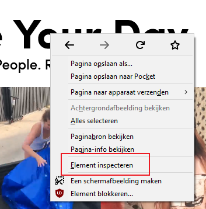

# FRONTEND-BASIC

## BASIS HTML-TAAK-07

### Developer Tools

Als developer maak je gebruik van diverse tools. Een daarvan is Google Chrome DevTools. Je kunt deze tools op verschillende manieren starten. Druk eens bijvoorbeeld op `F12` van je toetsenbord. Maar je kunt ook je `rechtermuisknop` gebruiken. Die laatste methode gebruiken we in de opdracht.

### OPDRACHT

1. Surf naar [Tiktok.com](https://www.tiktok.com/)
2. Klik met je rechtermuisknop op `"Make Your Day"`
3. Kies daarna element selecteren 
4. De tekst `Make Your Day` staat in een koptekst-tag. Kan jij bepalen welke?
5. De tekst eronder staat ook in een koptekst-tag. Kan jij deze ook bepalen?
6. Aan de onderkant van de webpagina staan nog meer gegevens. Vaak zijn dit bedrijfsgegevens of extra informatie die handig kan zijn. Dit stuk noemen ze de footer van een pagina (zie afbeeldingen hieronder). Kun jij achterhalen tussen welke tags de kopjes en links staan?
   
   ![footer TikTok]images/footer-tech.png)

<!--- ------------ DIT COMMENTAAR LATEN STAAN AUB ------------
------------------ ------------------------------ ------------
------------------ eagle ref:59222379
------------------ ------------------------------ ------------
------------------ DIT COMMENTAAR LATEN STAAN AUB -------- -->