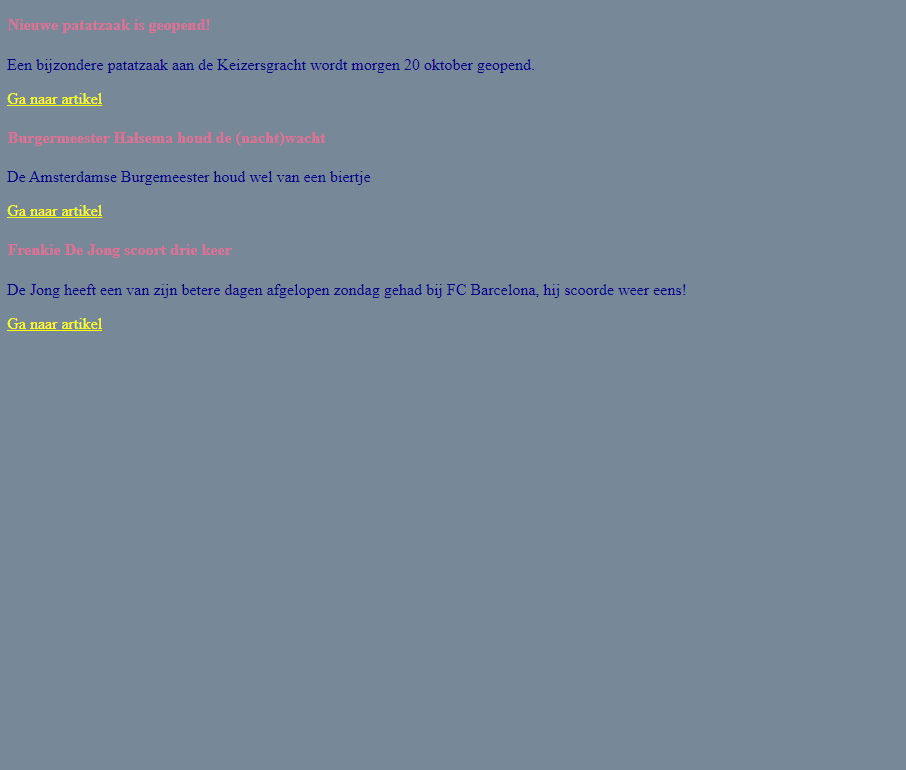

# FRONTEND-BASIC

## BASIS CSS-TAAK-03

### Meerdere tags stylen

Bij de vorige taak heb je de `<body>` en de `<h1>` tag gestyled. Nu gaan we nog meer tags stylen.

Je gaat nu de volgende tags stylen: `
` en `<h4>` en `<a>`.

### OPDRACHT

1. Maak gebruik van index.html bij deze taak
2. Zet tussen de `<head>` en de `</head>`-tags de ``-tags (zoals bij de vorige opdracht)
3. Maak gebruik van de artikelen pagina die je eerder gemaakt hebt. Nu moet je ook `<a>` gebruiken en stijlen
4. Geef alle h4-tags een tekstkleur naar keuze.
5. Geef de p-tags een donkere tekstkleur naar keuze.
6. Geef de anchor-tags een gele tekstkleur.
7. Geef de achtergrond van de pagina een grijze kleur.

#### Artikel 1

- titel = 'Nieuwe patatzaak is geopend!'
- tekst = 'Een bijzondere patatzaak aan de Keizersgracht wordt morgen 20 oktober geopend.'
- link = "artikel1.html"

#### Artikel 2

- titel = 'Burgermeester Halsema houdt de (nacht)wacht'
- tekst = 'De Amsterdamse Burgemeester houdt wel van een biertje'
- link = "artikel2.html"

#### Artikel 3

- titel = 'Frenkie De Jong scoort drie keer'
- tekst = 'De Jong heeft een van zijn betere dagen afgelopen zondag gehad bij FC Barcelona, hij scoorde weer eens!'
- link = "artikel3.html"

### RESULTAAT

### BRONNEN

- [CSS leren schrijven - Les 2](https://www.youtube.com/watch?v=X58h-d5sHsE)

<!--- ------------ DIT COMMENTAAR LATEN STAAN AUB ------------
------------------ ------------------------------ ------------
------------------ eagle ref:46823719
------------------ ------------------------------ ------------
------------------ DIT COMMENTAAR LATEN STAAN AUB -------- -->