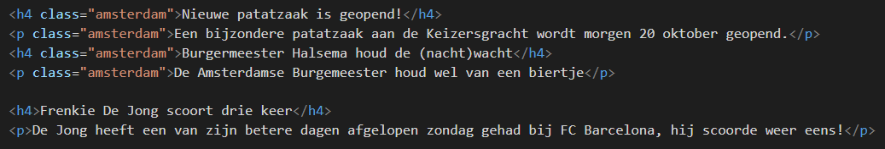

# FRONTEND-BASIC

## BASIS CSS-TAAK-04

### Class gebruiken

Bij de vorige opdracht heb je alle `<h4>` tags dezelfde stijl gegeven. Dit geldt ook voor alle `<p>` tags. Je kunt elke afzonderlijke of een groep `<p>`-tags anders stylen als je dat zou willen. Dat doe je met het __class__-attribuut.

Stel je alleen de artikelen over Amsterdam anders wilt stylen, dan kun je met een ___class__ attribuut deze specifieke tags anders stylen.

Een class is een eigenschap van een tag. Je schrijf het zo in html:
> class="amsterdam"
>
```html
<p class="amsterdam">De tekst komt hier</p>
<p >Hier staat weer andere tekst</p>
```

Als je de tag met die class wilt stijlen dan kan je dat in CSS doen met een __`.`__

```css
    .amsterdam{
        color: red;
    }

```

Zie je dat er een punt vooraf gaat aan het woord _amsterdam_?

Kijk ook eens naar onderstaande afbeelding:



### OPDRACHT

1. Maak gebruik van je gemaakt werk bij taak03
2. Style de tags die gaan over Amsterdam de class _amsterdam_ met een andere kleur.
3. Wat is je eindresultaat?

### BRONNEN

- [Classes gebruiken (.) - Les 3](https://www.youtube.com/watch?v=E--hpftoXKc)


<!--- ------------ DIT COMMENTAAR LATEN STAAN AUB ------------
------------------ ------------------------------ ------------
------------------ eagle ref:79344957
------------------ ------------------------------ ------------
------------------ DIT COMMENTAAR LATEN STAAN AUB -------- -->