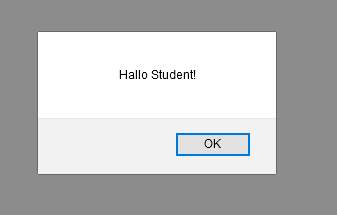

# FRONTEND-BASIC

## BASIS JAVASCRIPT-TAAK-01

### Introductie

Je hebt inmiddels geleerd dat je met HTML de structuur van een site kunt coderen. Daarnaast heb je geleerd dat je met CSS diezelfde tags een stijl kunt geven.

Met Javascript kun je interactie op een website laten plaatsvinden.
Je kunt dingen laten bewegen, de gebruiker om informatie vragen en, als je veel verder bent, hele applicaties of games maken. `Javascript` is een echte programmeertaal.

### OPDRACHT

1. Open `index.html` in je browser.
2. Bekijk eens wat er gebeurt.

### RESULTAAT

<!--- ------------ DIT COMMENTAAR LATEN STAAN AUB ------------
------------------ ------------------------------ ------------
------------------ eagle ref:34221546
------------------ ------------------------------ ------------
------------------ DIT COMMENTAAR LATEN STAAN AUB -------- -->