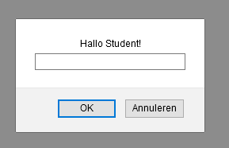

# FRONTEND-BASIC

## BASIS JAVASCRIPT-TAAK-02

### Popup boxen

Bij de vorige opdracht verscheen er een `alert-box`. Dit is een soort waarschuwing naar de gebruiker toe. Dit noemen ze de __`output`__ van een applicatie. De gebruiker kan op de knop `OK` klikken om de box te laten verwijnen. Dus je vraagt de gebruiker om __`input`__. Als een gebruiker niet op OK klikt dan kan de gebruiker niet verder. Dit noemen ze een modal. De pagina wacht op input van de gebruiker, daarna kan de gebruiker weer verder met de rest van de applicatie.

Je kunt zelf ook zo'n alertbox maken. Door gebruik te maken van Javascript. Om Javascriptcode te kunnen schrijven moet je in je HTML-pagina aangeven wat Javascript is. Net als bij je CSS-codeblok. Je gebruikt hiervoor `script` tags

```html
<script></script>
```

Daartussen kun je Javascript code schrijven. Bij de vorige opdracht stond daar dit tussen:

```js
 alert("Hallo Student");
```

> Let hierbij goed op de haakjes (`()`), aanhalingstekens (`"`) en dubbele punt (`;`)

Er zijn nog meer van dit type `popup`-boxen

- alert();
- confirm();
- prompt();

### OPDRACHT

1. Open `index.html` in je browser.
2. Verander de alert-box naar confirm()
3. Verander de alert-box naar prompt()
4. Check je antwoorden met het resultaat

### RESULTAAT





<!--- ------------ DIT COMMENTAAR LATEN STAAN AUB ------------
------------------ ------------------------------ ------------
------------------ eagle ref:44117910
------------------ ------------------------------ ------------
------------------ DIT COMMENTAAR LATEN STAAN AUB -------- -->