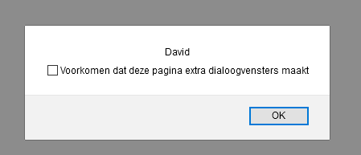

# FRONTEND-BASIC

## BASIS JAVASCRIPT-TAAK-04

### Variabelen 2

Ok, je weet nu hoe je een variabele moet maken. Maar wat kun je er nou mee? Stel het volgende eens voor. Een gebruiker vult een formulier of prompt()-box in. Deze gegevens wil je als developer kunnen gebruiken. Kijk eens naar dit voorbeeld.

```html
<script>
    let mijnVoornaam = "David";
    alert(mijnVoornaam);
</script>
```

Met deze code staat er `David` in de variabele `mijnVoornaam`. Je kunt ook zeggen: _mijnVoornaam bevat de waarde "David"_

Ook hier is een specifieke schrijfwijze gebruikt:

- de naam van de variabele begint met een kleine letter
- het tweede woord in een variabele is een hoofdletter mijn`V`oornaam
- een `=` teken wordt gebruikt om de variable te 'vullen'
- een woord of zin zet je tussen `"` en `"`
- een getal hoef je niet tussen aanhalingstekens te zetten
- een regel eindigt met een `;`

Dit is een beetje saaie code, we willen tenslotte aan elke gebruiker zijn of haar naam opvragen met de prompt-box

```html
<script>
    let mijnVoornaam = prompt("Vul je voornaam in aub");;
</script>
```

Nu wordt de __input__ van de gebruiker (`voornaam`) gestopt in de variabele `mijnVoornaam`

> We doen nog verder niks met de variabele maar dat gaan we wel doen. Er is dus geen __output__.

Zie dat het woordje `let` is gebruikt? Dit is het woordje waarmee je een variabele kunt maken. Hieronder een paar voorbeelden

```js
let mijnLeeftijd = 42;
let mijnAchternaam = "van Oudheusden";
let merkAuto = "BMW";
```

### OPDRACHT

1. Open `index.html` in je browser.
2. Geef je naam op. Wat zie je daarna gebeuren?
3. Bestudeer de code eens.
4. Wat is de input?
5. Wat is de output?

### RESULTAAT




<!--- ------------ DIT COMMENTAAR LATEN STAAN AUB ------------
------------------ ------------------------------ ------------
------------------ eagle ref:91571551
------------------ ------------------------------ ------------
------------------ DIT COMMENTAAR LATEN STAAN AUB -------- -->