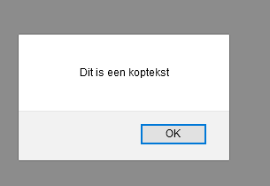

# FRONTEND-BASIC

## BASIS JAVASCRIPT-TAAK-05

### querySelector

Oké. Nu gaan we de geleerde dingen combineren.

Je weet dat er verschillende `HTML`-tags zijn die je op verschillende wijzen kunt stylen met `CSS`. En je hebt geleerd om __input__ te vragen van een gebruiker en __output__ te tonen met `Javascript` (`JS`).

Ook kun je met Javascript HTML-tags aanpassen of zelfs verwijderen.

Om HTML-tags te kunnen beïnvloeden met JS moet we er eerst een zien te vinden. Dit werkt ongeveer hetzelfde als bij CSS. Bij CSS gebruikten we de `tag`-naam om bijvoorbeeld de tekst rood te maken

```css
h1{
    color:red;
}
```

Bij Javscript werkt dat ongeveer net zo.

```html
<script>
    let element = document.querySelector("h1");
</script>
```

Laten we de code even uitleggen:

```js
    let element = //dit is het aamaken van de variabele

    document //dit betekent het HTML-document/pagina inladen in JS.

    querySelector("h1") // deze code gaat op zoek naar h1-element. Het is een soort zoekmachine binnen je webpagina.

    //let op de schrijfwijze. Er staat een punt (.) tussen document en queryselector

    document.querySelector("h1");
```

Wat kun je hier nou mee? Je kunt bijvoorbeeld de tekst die tussen `<h1>` en `</h1>` staat  ophalen en in een alertbox zetten.

### OPDRACHT

1. Open `index.html` in je browser.
2. Wat zie je?
3. Bestudeer de code eens. Je ziet dat het element `<h1>` is opgehaald
4. Je ziet ook dat `koptekst.innerHTML` in de `alert`-box wordt gezet om het onderstaande resultaat te krijgen
5. Als je de laatste regel bekijkt, dan zie dat er een stukje code in commentaar staat. Kan je dit weghalen?
6. Wat zie je in de browser gebeuren? Goed kijken!

### RESULTAAT




<!--- ------------ DIT COMMENTAAR LATEN STAAN AUB ------------
------------------ ------------------------------ ------------
------------------ eagle ref:73917805
------------------ ------------------------------ ------------
------------------ DIT COMMENTAAR LATEN STAAN AUB -------- -->