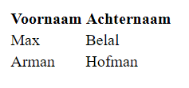

# FRONTEND-ESSENTIALS

## NOG MEER TAGS

## taak06 - Table for two

### Introductie

Je zult ook het volgende voorbeeld herkennen of gebruikt hebben. Of het nou in Word is geweest of excel. Tabellen heb je eerder gebruikt of gezien.
Die ga je in deze taak zelf maken met de `<table>` tag.

Een table heeft een openings en sluit tag. Daarnaast heeft een table een head `<thead>`, een body `<tbody>`.
Ook heeft een table rijen `<tr>` en cellen `<td>`.

Dat ziet er dan zo uit:

```html

<table>
    <thead>
        <tr>
            <th>Voornaam</th>
            <th>Achternaam</th>
        </tr>
    </thead>
    <tbody>
        <tr>
            <td>Max</td>
            <td>Belal</td>
        </tr>
        <tr>
            <td>Arman</td>
            <td>Hofman</td>
        </tr>
    </tbody>
</table>

```

Met dit resultaat:



Bestudeer het bovenstaande goed.

### OPDRACHT

1. Maak een index.html bestand in deze map
2. Codeer de standaard tags op elke pagina (weet je ze even niet kijk dan bij FRONTEND-BASIC => 03-Basis HTML => taak 02)
3. Maak een tabel met jouw gegevens
4. Met bovenin dikgedrukt: Voornaam, Leeftijd, Aantal broers/zussen, lievelingseten, idool, sport, en favoriete game
5. Aan het eind heb je een tabel gemaakt met de juiste gegevens.
