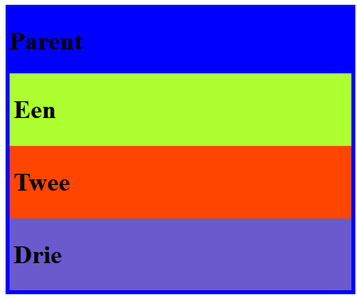
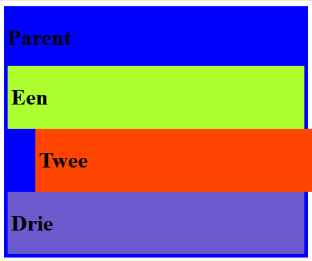
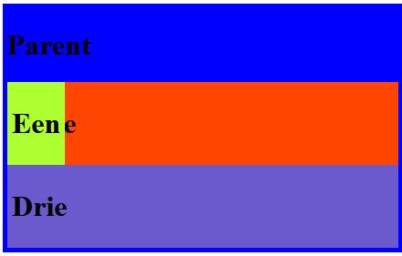
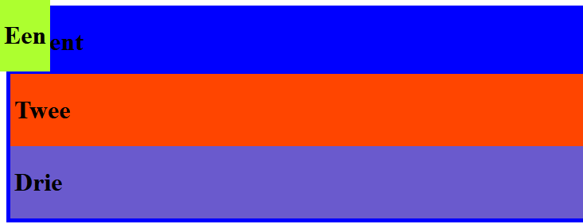
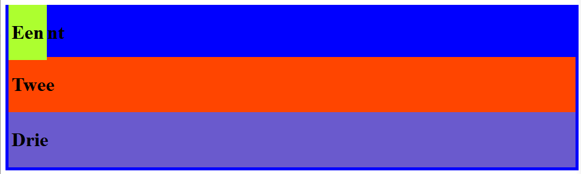
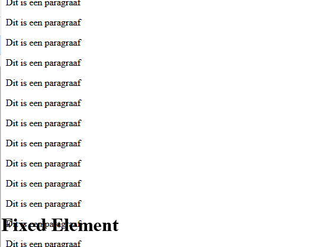
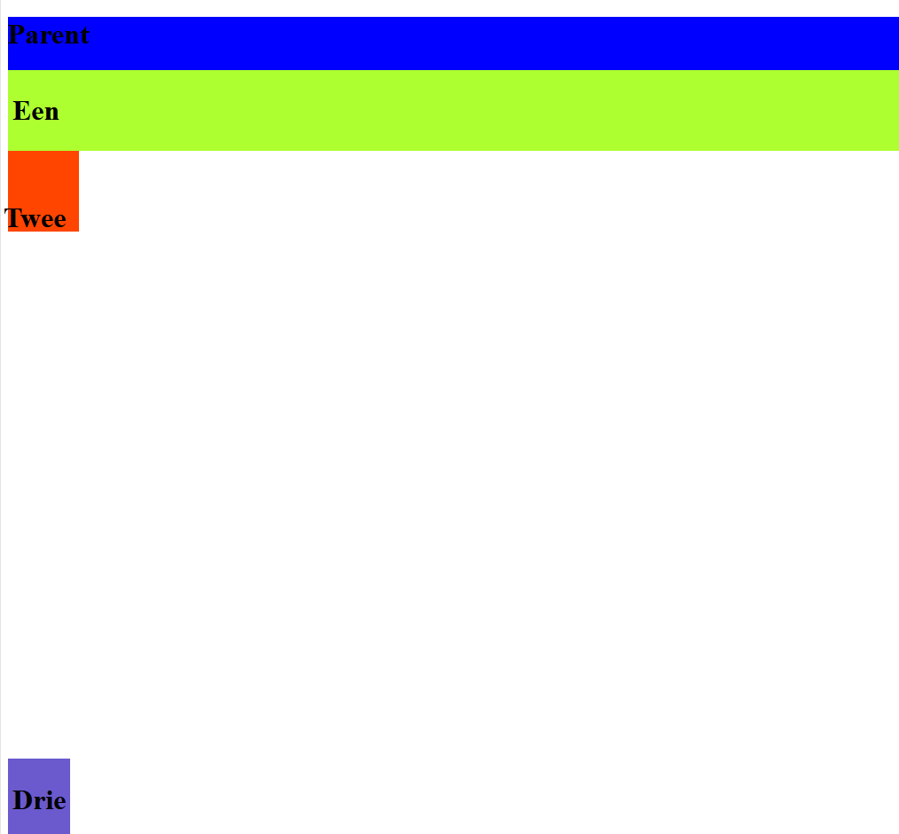

# FRONTEND-ESSENTIALS

## CSS BOX MODEL

## taak04 - Positions

### Introductie

Je kunt met de CSS property `position` elemente op een bepaalde, specifieke plek neerzetten op een webpagina. Hier staan de belangrijkste waardes:

- static
- fixed
- relative
- absolute

Je kunt ze op de volgende wijzes gebruiken:

#### Static

```css

.child{
    position: static;
}

```

De standaard property voor elk element is static. Als je geen position aangeeft dan heeft een element automatisch static. Dus deze hoef je niet in te stellen. Het element wordt in de volgorde neergezet van de [flow](https://developer.mozilla.org/en-US/docs/Learn/CSS/CSS_layout/Normal_Flow) van de site. Elke element wordt op de website getoond in de vorm van wie het eerste komt, wordt als eerste getoond:

```html
<div #id="een"></div> <!-- Deze div wordt als eerste op het scherm getoond-->
<div #id="twee"></div>
<div #id="drie"></div> <!-- Deze div wordt als laatste op het scherm getoond-->
```

In alle voorbeelden in deze taak kun je gebruik maken van `index.html`. Hierin zie je dat de `<div>` elementen gewoon netjes onder elkaar geplaatst worden. Ja sommige elementen (child) zitten in een andere element (parent). Dit werkt gewoon zoals het hoort.



#### Relative

Met `relative` haal je het document gedeeltelijk uit de __flow__. Het is niet meer _static_. Je kunt er nu posities mee veranderen. Als een element de display property `position: relative` heeft dan kun je met `top`, `right`, `bottom`, `left` de positie van een element veranderen. __dit kan niet met static elements__

Kijk eens naar onderstaand voorbeeld. Ik heb de tweede child-div (de rode) de volgende CSS code gegeven:

```css
    #child-2{
        background-color: orangered;
        position:relative;
        left:40px;
    }
```

Dit resulteert in een naar rechts `gesprongen` `<div>`-element. Want er zijn `40 pixels aan de linkerkant toegevoegd`



Probeer het eens zelf met de overige child elementen.

#### Absolute

Met position `absolute` wordt het element in zijn geheel uit de flow van de pagina weggehaald. Het is alsof het niet meer bestaat, althans dat denken de overige elementen. Die 'zien' het element niet meer. Dus wie het eerste komt die mag als eerste op het scherm, dat gaat niet helemaal meer op.

```css
 #child-1{
    background-color: greenyellow;
    position: absolute;
}
```



Stel nou eens dat je hier een `top:0px;` en `left:0px` op toepast. Wat gebeurt er dan? Het element gaat de pixels tellen vanaf de bovenkant en de linkerkant van het scherm en maakt daar de ruimte (bij 0 pixels zit het element in zijn geheel tegen de rand van je browser)



Waarom gaat het niet bovenaan de parent zitten? Waarom helemaal bovenin? Waarom __absoluut__ ten opzichte van het gehele scherm?

Omdat de __parent nog `static` is__. Als je de parent relative maakt dan werkt absolute t.o.v. de parent, kijk maar:

```css
.parent{
    background-color: blue;
    padding:5px;
    position: relative; /*parent is nu niet meer static */
}

#child-1{
    background-color: greenyellow;
    position: absolute;
    top:0px;
}
```

Het resultaat van bovenstaande code is dan: de groene div start bij de bovenkant van de parent (blauwe div)



#### Fixed

```css

.child{
    position: fixed;
    top:0;
    right:0;
}

```

Met `fixed` kun je een element vastmaken aan het scherm of beter gezegd aan de window van je browser. Kijk maar eens bij `fixed.html`.

Je ziet het element met het id="fixedElement" die blijft staan, ook als je naar beneden scrollt. Het element blijft staan aan de rechterkant, bovenin. Verander de CSS eens om het element naar links en naar onder te verplaatsen.
Wat gebeurt er dan?



Oke. Cool. Dat was fixed. Je moet dus wel gaan aangeven waar het element gefixed is.

### Opdracht

1. Maak gebruik van index.html.
2. Verander eens de derde child-element in een fixed element en daarbij een bottom van 0px;
3. Verander eens de tweede child-element in een absoluut element
4. Maak het h1 element in het tweede child-element eens relative en geef het een top: 30px en een right:10px

    

5. Er is nog een position mogelijkheid die hier niet besproken is. `sticky`. Probeer deze eens zelf uit

### Bronnen

[Learn CSS Position In 9 Minutes](https://www.youtube.com/watch?v=jx5jmI0UlXU)
