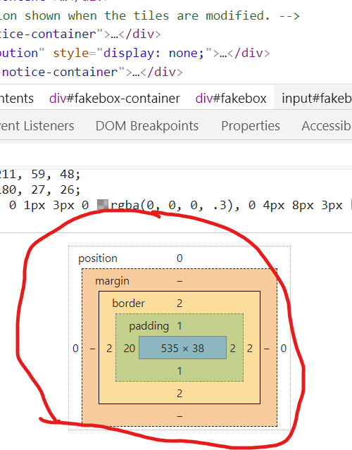
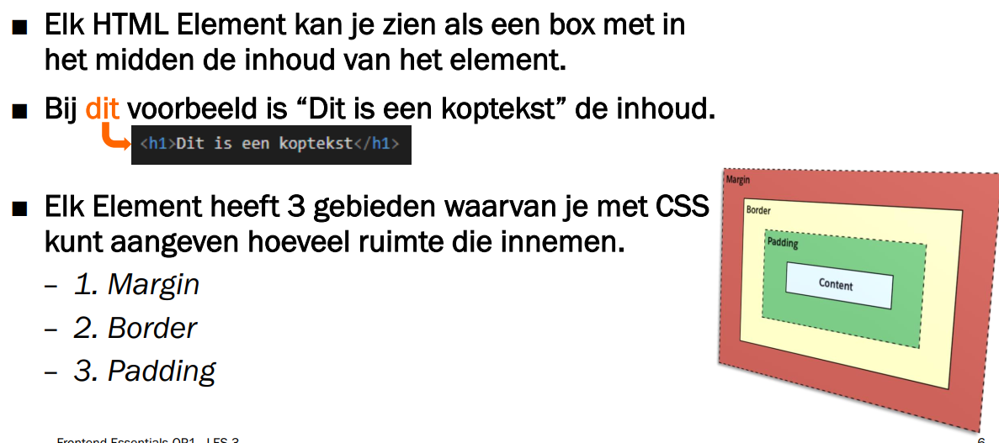
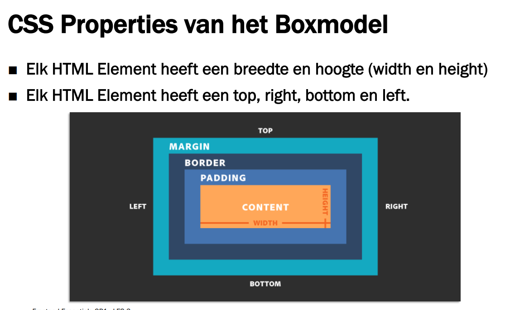

# FRONTEND-ESSENTIALS

## CSS BOX MODEL

## taak01 - Out of the Box

### Introductie

Weet je nog dat websites uit blokken bestaan? We zeggen ook wel boxen. Websites bestaan uit boxes. Sterker nog, alle HTML tags zijn eigenlijk een box.

Je kunt elke website inspecteren met Google DevTools in je Google Chrome browser.
Inspecteer een HTML element in je Google DevTools en je ziet het zogenaamde BOX-MODEL te tevoorschijn komen. (misschien dat je even naar beneden moet scrollen)

In deze slide zie je nog een voorbeeld:

Je ziet dat er drie gebieden zijn die je kunt beïnvloeden als developer:

- margin
- border
- padding

Dat gaan we in de komende taken beinvloeden.

In onderstaand voorbeeld zie je deze woorden ook weer terugkomen.

Je ziet dat

- __BORDER__ om het element heen zit.
- __MARGIN__ is de ruimte buiten het element
- __PADDING__ is de ruimte tussen de inhoud en de border van het element

### OPDRACHT

1. Ga naar [Bol.com](https://www.bol.com/nl/)
2. Klik met je rechtermuisknop op de bovenste blauwe balk en kies in het menu `Inspecteren`
3. In de devtools  op het `Elements` tabblad zoek je naar `<header class="wsp-header js_main_header">`. Klik deze aan
4. In de Styles box aan de rechterkant scroll je naar beneden totdat je het __BOXMODEL__ ziet.
5. Verander eens de __TOP__ margin van de zoekbalk. Dit doe je door dubbel te klikken op het `-` teken van margin: 
6. Als het goed is dan zie je nu dan de blauwe balk naar beneden is gekomen. Je hebt de margin van dit element aangepast, vergroot. Er is ruimte aan de bovenkant ontstaan tussen de balk en de bovenkant.

