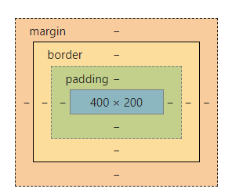
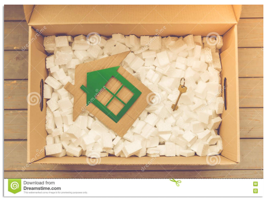
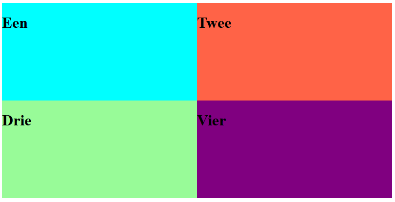
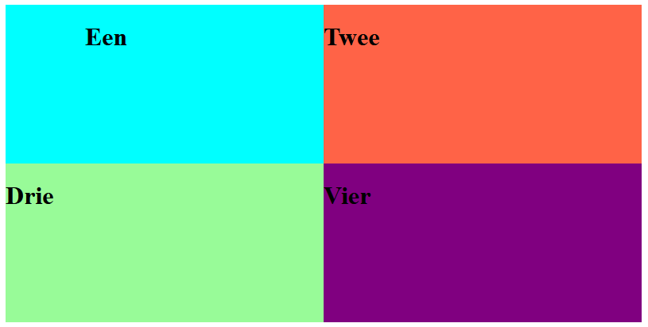
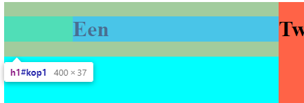
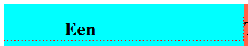
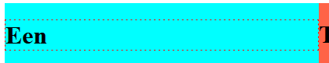
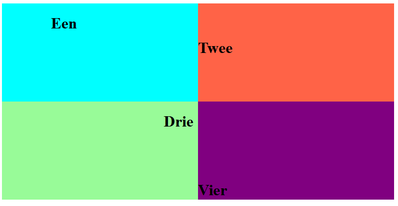

# FRONTEND-ESSENTIALS

## CSS BOX MODEL

## taak03 - Padding on the back

### Introductie

Naast `margin` vind je ook `padding` terug in het CSS Box-model. Kijk maar eens in de DevTools. Dan zie je het volgende plaatje:



Je ziet in het groen `padding` staan. Maar wat is nou die padding. Kijk eens naar onderstaande foto:



In deze foto is

- de rand van de doos de `border`
- de ruimte buiten de box de `margin`
- het groene huisje en de sleutel de belangrijkste inhoud
- en het piepschuim is de padding: de ruimte tussen de inhoud en de border

Bij een grotere doos met dezelfde inhoud was de padding dus heel groot geweest.

Als je index.html opent dan zie je het volgende:



Als je nu de volgende CSS code toepast:

```css
    #kop1{
        padding-left:100px;
    }
```

Dan zie je iets veranderd. Zoek het verschil:



Het woord `"Een"` is veranderd, het is iets naar rechts gegaan. Er is padding bij gekomen. Zo ziet dat eruit als je het element zou inspecteren:



Er is ruimte ontstaan tussen de border van `#kop1` en de inhoud van `#kop1`.

Kijk maar eens naar het volgende plaatje waarbij dus een `padding-left` is toegepast



En zonder `padding-left` zou dat er zo uitzien:



En net als bij margin kun je `top`, `right`, `bottom`, `left` gebruiken

### Opdracht

1. Maak gebruik van `index.html`
2. Maak gebruik van de CSS properties `padding-top`, `padding-right`, `padding-bottom` en/of `padding-left` om tot het eindresultaat te komen
3. Wees zo kritisch mogelijk naar jezelf.

### Eindresultaat



### OPMERKING

Het lijkt wel dat je met padding kunt positioneren. Maar daarvoor wordt het niet gebruikt. Het gaat om `RUIMTE` maken.
