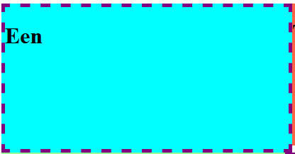
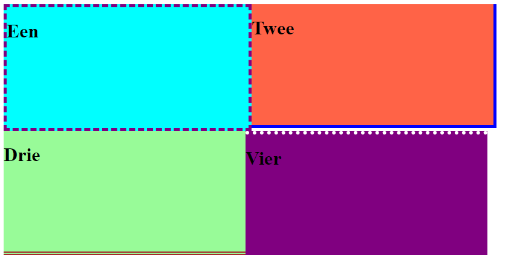

# FRONTEND-ESSENTIALS

## CSS BOX MODEL

## taak04 - Border Control

### Introductie

Bij de opdracht over `padding` heb je al een afbeelding voorbij zien komen met een `border`. Daar gaat deze oefening over. Je kunt om elk HTML-element een randje coderen. Een doorgetrokken lijntje of een stippellijntje, zwart, rood wat jij wilt.

De CSS code daarvoor is als volgt:

```css

#element1{
    border: 5px dashed purple;
}
```

En dan is dit het resultaat



Je kunt hier natuurlijk zelf verder mee experimenteren.

Je kunt `border-top`, `border-left`, `border-bottom` en `border-right` ook gebruiken.

### Opdracht

1. Maak gebruik van index.html
2. Probeer met behulp van bovenstaande info tot het eindresultaat te komen.
3. Maak daarbij gebruik van dashed, dotted, double, solid (zie bronnen)

### Eindresultaat



### Bronnen

> [Borders](https://www.w3schools.com/css/css_border.asp)
