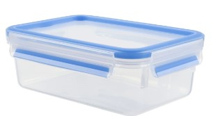
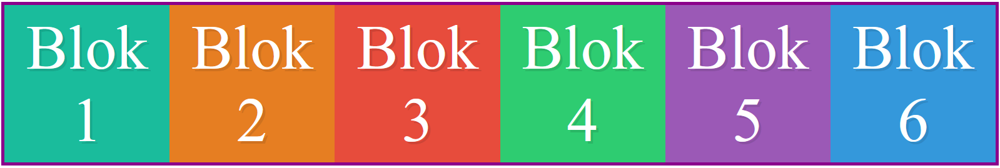
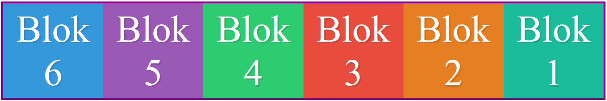
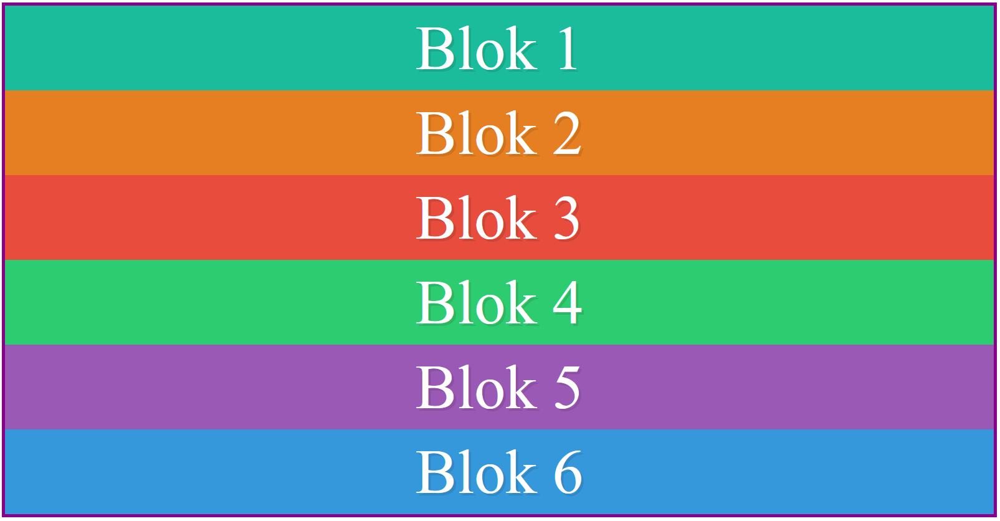
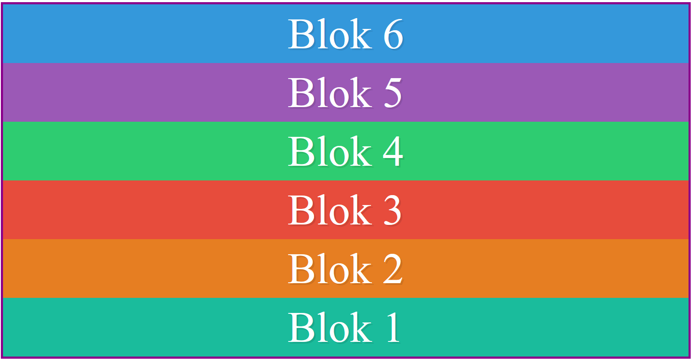

# FRONTEND-ESSENTIALS

## FlexBox

## taak01 - What the Flex

### Introductie

Flexbox is een layout module binnen CSS. Een developer kan er dus layout mee instellen. Je hebt inmiddels geleerd dat een element in een ander element kan zitten. Dit noemen we parent-child verhouding. Soms kun dit ook noemen als container-items verhouding:

```html
    <div class="container">
        <div id="item-1" class="items"></div>
        <div id="item-2" class="items"></div>
    </div>
```

De div met de class=`container`  is de parent van beide div met class=`items` , die childs (of items) worden genoemd.

> Kortom: een container bevat items.

Denk aan een vershoudbakje in de keuken. Daar kun je rozijnen, suiker, brood of andere producten in bewaren. Het bakje is de container, de producten zijn de items.



Maar wat heeft dat met Flexbox te maken? Goeie vraag. De Flexbox-layout geeft de container de mogelijkheid om de items te beinvloeden, op zo'n manier dat de ruimte waarin de items zich bevinden goed benut worden.

Ja maar hoe werkt dat dan? Weer een goeie vraag!

Ok stel dat je volgende HTMl-code hebt: (zie index.html). En je hebt deze gestyled (zie nog steeds index.html)

```html
    <div class="container">
        <div id="item-1" class="items">Blok 1</div>
        <div id="item-2" class="items">Blok 2</div>
        <div id="item-3" class="items">Blok 3</div>
        <div id="item-4" class="items">Blok 4</div>
        <div id="item-5" class="items">Blok 5</div>
        <div id="item-6" class="items">Blok 6</div>
    </div>
```

De items (de divs) komen onder elkaar te staan, nemen de gehele breedte van je browser venster in beslag.

Nu kun je deze blokken (items dus) beinvloeden door de container aan te passen:

```css
    .container{
        border:5px solid darkmagenta;
        display:flex;
    }
```

Try it yourself.

Je moet nu dit hebben:


De blokken komen naast elkaar. Maar hoe kan dat nou weer? (weer een hele goeie vraag! Lekker bezig!)

Als je flexbox toepast op een container dan staat ook de volgende waarde standaard aan: `flex-direction:row;`

```css
    .container{
        display:flex; /* Dit had je al gedaan */
        flex-direction: row; /* alles op een rij zetten. */
    }
```

### Opdracht

1. Maak gebruik van dezelfde index.html
2. Verander eens de flex-direction naar een van de volgende waardes:
   - row
   - row-reverse
   - column
   - column-reverse
3. Commit elke wijziging van deze taak

### Eindresultaat

> - ROW 
> - ROW-REVERSE 
> - COLUMN 
> - COLUMN-REVERSE 

### Bronnen

[A Complete Guide to Flexbox](https://css-tricks.com/snippets/css/a-guide-to-flexbox/)
