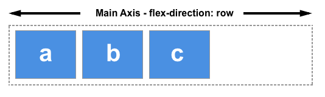
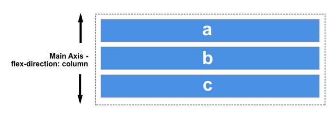
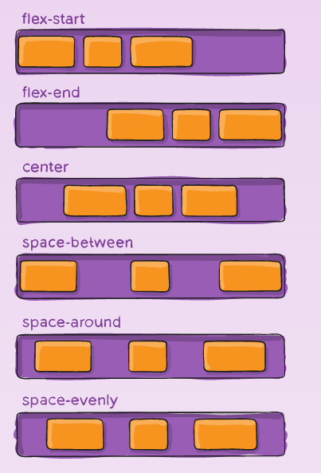
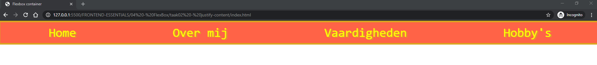

# FRONTEND-ESSENTIALS

## FlexBox

## taak02 - Flexbox Justify Content

### Introductie

Ok. Met Flexbox kun je een parent-div (container) een `display:flex` geven en dan veranderen de items. Die worden flexibel...

Met Flexbox kunnen we de `hoofd-as` (main-axis) veranderen. Als we alleen de container `flex` maken dan is de hoofas zo:



Maar je kunt het ook als volgt opschrijven:

```css
    .container{
        display:flex;
        flex-direction: row; /* of row-reverse */
    }
```

Als je er een `column` van maakt dan loopt de hoofd-as van boven naar beneden  (of andersom met `column-reverse`)

```css
    .container{
        display:flex;
        flex-direction: `column`; /* of column-reverse */
    }
```



De hoofd-as is het pijltje. Dus van boven naar beneden. Alle items (divs) staan onder elkaar.

Als we de `hoofd-as` van een `container` (doosje) veranderen dan verandert ook de volgorde van de items, zie vorige taak.

Je kunt de hoofd-as dus van links naar recht laten gaan met `flex-direction: row;`

Als de hoofd-as van links naar rechts gaat dan kun je ook de volgende CSS code toepassen: `justify-content:center;` De items komen dan in het midden te staan.

```css
    .container{
        display:flex;
        flex-direction: row;
        justify-content: center;
    }
```

Er zijn nog meer opties:



Try them all! Je kunt `justify-content.html` gebruiken om te oefenen

### Opdracht

1. Maak een navigatiemenu met tenminse drie links
   - Maak gebruik van `<nav>`, `<ul>`, `<li>` en `<a>`
2. Stijl deze zo mooi mogelijk (google naar ideeën)
   - Maak ten minste gebruik van
     - `width`
     - `background-color` of `background`
     - `padding`
     - `border`
     - `display:flex`
     - `justify-content`
     - `list-style-type:none`
     - `color`
     - `font-family`
3. Bedenk op welke HTML-tag je een container moet aanbrengen met flexbox
4. Stel de container in op 100% width
5. Bedenk dat je list-item wilt stijlen met `list-style-type:none`
6. Pas de verschillende flexbox `justify-content` property toe. Welke heeft jouw voorkeur bij een menu?

### (mogelijk) Eindresultaat



### Bronnen

- [A Complete Guide to Flexbox](https://css-tricks.com/snippets/css/a-guide-to-flexbox/)
- [Basic concepts of flexbox](https://developer.mozilla.org/en-US/docs/Web/CSS/CSS_Flexible_Box_Layout/Basic_Concepts_of_Flexbox)
