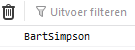
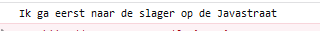
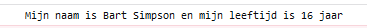

# FRONTEND-ESSENTIALS

## Javascript

## taak04 - String kan plakken

### Introductie

Je hebt kennis gemaakt met het datatype String. _(Iets dat tussen aanhalingstekens staat)_ Het mooie aan een string is dat je er dingen mee kan doen...

Je kunt strings aan elkaar plakken met een __`+`__

#### Plakken

Een string kun je plakken op verschillende wijzes

```js
let mijnVoornaam = "Bart";
let mijnAchternaam = 'Simpson';

let volledigeNaam = mijnVoornaam + mijnAchternaam;
console.log(volledigeNaam);
```

Dan komt er dit in de console te staan: `BartSimpson`. Oh nee!! De voornaam en achternaam zijn aan elkaar geplakt!



Hoe kun je dit nou oplossen? 2 manieren!

Je kunt een spatie achter voornaam plaatsen

```js
let mijnVoornaam = "Bart "; /* er is een spatie gezet achter Bart */
let mijnAchternaam = 'Simpson';

let volledigeNaam = mijnVoornaam + mijnAchternaam;
console.log(volledigeNaam);
```


Je kunt ook een lege string tussen voornaam en achternaam plaatsen

```js
let mijnVoornaam = "Bart";
let mijnAchternaam = 'Simpson';

let volledigeNaam = mijnVoornaam + " " +  mijnAchternaam;
console.log(volledigeNaam);
```


Je kunt ook tekst plakken aan variabelen:

```js
let winkel = "slager";
let straatnaam = 'Javastraat';

let volledigeZin = "Ik ga eerst naar de " + winkel + "op de " + straatnaam;
```



### Opdracht

1. Maak een index.html met de gebruikelijke tags en daarbij ook een script tag. (je kunt de index.html van taak01 nemen ;)
2. Declareer de volgende variabelen en geef ze een waarde: `mijnVoornaam`, `mijnAchternaam`, `mijnLeeftijd`.
3. Schrijf de volgende zin in de console:
    > Mijn naam is `<voornaam>` `<achternaam>` en mijn leeftijd is `<leeftijd>` jaar
4. Is de variabele mijnLeeftijd ook van het datatype String?
  
Uiteraard wordt er verwacht dat je de voornaam, achternaam en leeftijd in deze zin vervangen voor waardes die je bij 1 hebt gedeclareerd.

#### Extra

> Plakken van strings noemen ze in het Engels __concatenate__

### Eindresultaat


