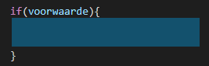
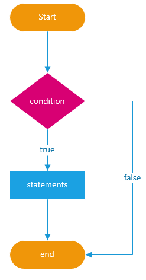

# FRONTEND-ESSENTIALS

## Javascript

## taak05 - if-statement

Als je uit een vliegtuig springt met een parachute dan heb je een keuze te maken: "Doe ik de parachute open of niet? Als ik dat niet doe dan val ik te pletter, doe ik het wel dan land ik veilig op de grond."


Je maakt een keuze en die heeft specifieke (soms definitieve) gevolgen.

In het programmeren kun je dit ook tegenkomen. Die keuze worden conditionals genoemd. Anders gezegd: Voorwaardes. Er moet aan een specifieke voorwaarde voldaan worden om die specifieke uitkomst te krijgen.

Een keuze zoals in het verhaal hierboven wordt als volgt in een zin omschreven, daarna wordt dezelfde zin in code.

> Als ik de parachute open dan land ik veilig op de grond

En zo kun je dat in code schrijven

```js
    let parachuteIsOpen = true;

    if(parachuteIsOpen){
        alert("Ik land veilig op de grond! Yeah!");
    }
```

Je ziet een if-statement staan. En tussen de haakjes bij de if -statement staat een boolean. Want dat is op regel 22 gedeclareerd met `true`.

Daarnaast zie je ook dat er accolades staan `{` en `}`. Dit geeft een code-blok aan. Een apart deel van de code.



Als de boolean variabele waar (true) is dan land je veilig.

```js
    let parachuteIsOpen = true; /* Hier is de parachute open */

    if(parachuteIsOpen){
        alert("Ik land veilig op de grond! Yeah!");
    }
```

Als de boolean variabele NIET waar (false) is dan stort je te pletter.

```js
    let parachuteIsOpen = false; /* Hier is de parachute NIET open */

    if(parachuteIsOpen){
        alert("Ik land veilig op de grond! Yeah!");
    }
```

> - Als het WAAR is dan wordt de alert() uitgevoerd.
> - Als het NIET WAAR is dan wordt de alert() niet uitgevoerd. De code tussen de accolades wordt niet uitgevoerd.



Je kunt ook het volgende coderen:

```js
    let x = 5;
    let y = 5;

    if(x == y){
        console.log("De twee getallen zijn gelijk.");
    }
```

In de if-statement staat een bepaalde voorwaarde (condition). Die bepaalt of de code tussen de accolades `{ }` wordt uitgevoerd of niet.

- Als die voorwaarde __true__ is dan krijgen we in de console de zin "De twee getallen zijn gelijk." te zien.
- Als de voorwaarde __false__ is dan krijgen we niks te zien in de console.

In bovenstaand voorbeeld zijn de getallen __gelijk aan elkaar__ en dus zegen we: de if-statement is `TRUE` en dus wordt de zin getoond!

### Opmerking

> - Je ziet twee = tekens staan: `==`
> - Dit is geen type-fout.
> - Dit noemen we een __vergelijkingsoperator__: je vergelijkt twee waardes
> - 1 = teken gebruik je bij het 'vullen' van een variabele (waarde toekennen)
> - 2 == gebruik je bij een vergelijking: de linkerkant vergelijk je met de rechterkant

### Opdracht

1. Maak een index.html met de gebruikelijke tags en daarbij ook een script tag. (je kunt de index.html van taak01 nemen ;)
2. Maak de volgende variabelen
   - mijnLeeftijd
   - stemGerechtigeleeftijd = 18;
3. Maak een if-statement die de waardes vergelijkt
4. Codeer een alert("Jij bent mag stemmen met de verkiezingen")-box met het resultaat

### Bronnen

- [Programmeren in Javascript/Conditionele statements](https://nl.wikibooks.org/wiki/Programmeren_in_JavaScript/Conditionele_statements)
- [javascripttutorial.com - if statement](https://www.javascripttutorial.net/javascript-if-else/)
  