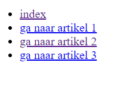

# FRONTEND-ESSENTIALS

## NOG MEER TAGS

## taak05 - Aan de navbar hangen

### Introductie

Om te kunnen navigeren op een website heeft een andere developer voor jou een navbar ontwikkeld. Dit is een combinatie van een aantal factoren. Ten eerste een unorderd `<ul>` list met `<li>` tags. Maar ook meerdere anchor `<a>` tags. We gaan er nu ook eentje maken maar dan zonder styling. Maar omdat browser en zoekmachines graag willen weten met welke onderdelen ze te maken hebben gebruiken we nog een specifieke tag: `<nav>` en `</nav>`. Met deze twee tags geef je aan dat alles dat hier tussen staat de navigatie aangeeft. Dit is/wordt steeds belangrijker. Zo'n `<nav>` tag noemen ze een semantic tag. Er zijn meer semantic tags. Het zijn tags die een specifiek onderdeel aangeven. `<article>` is er ook een. Er zijn er meer. Zoek ze maar eens op.

### OPDRACHT

1. Maak een index.html bestand in deze map
2. Maak een artikel01.html pagina
3. Maak een artikel02.html pagina
4. Maak een artikel03.html pagina
5. Codeer de standaard tags op elke pagina (weet je ze even niet kijk dan bij FRONTEND-BASIC => 03-Basis HTML => taak 02)
6. Maak op elke pagina dezelfde unorderd list met daarin list items, en in die list items zet je `<a>` tags die verwijzen naar de 4 verschillende pagina's
7. Als het goed is kun je nu linken tussen de verschillende pagina's. Gefeliciteerd je hebt een menu gemaakt met HTML.

### Eindresultaat

