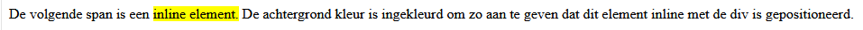
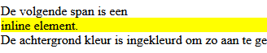

# FRONTEND-ESSENTIALS

## CSS BOX MODEL

## taak02 - Inline Elements

### Introductie

Inline elementen staan _in de lijn_ dit betekent dat ze niet een nieuwe regel beginnen en dus onderdeel uitmaken van dezelfde lijn als de parent-element

```html
<div>De volgende span is een <span id="opvallen">inline element.</span> De achtergrond kleur is ingekleurd om zo aan te geven dat dit element inline met de div is gepositioneerd.</div>
```

```css
#opvallen{
    background-color: yellow;
}
```



Inline elementen starten nooit een nieuwe regel

### OPDRACHT

1. Maak een index.html en neem de code hierboven in zijn geheel over.
2. Verander de `<span>` tags in `<div>` tag en kijk eens wat het verschil is tussen een block en een inline element.

### Eindresultaat



### Bronnen

[Inline elementen](https://developer.mozilla.org/en-US/docs/Web/HTML/Inline_elements)