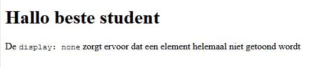
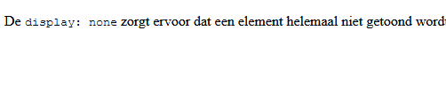

# FRONTEND-ESSENTIALS

## CSS BOX MODEL

## taak03 - Display Property

### Introductie

Je kunt elementen beinvloeden met CSS. Je kunt kleuren wijzigen maar je kunt ook bepalen of een element inline, block of onzichtbaar is. Dat kun je met het `display`-property met CSS.

```css
span {
    display: block;
}
a {
    display: block;
}
```

### OPDRACHT

1. Maak gebruik van de meegeleverde `index.html`
2. Je ziet op je scherm het volgende staan
       
3. Probeer eens het `<h1>` element onzichtbaar te maken met _CSS_. Check de bronnen

### Eindresultaat



### Bronnen

[CSS - Display](https://www.tutorialrepublic.com/css-tutorial/css-display.php)
