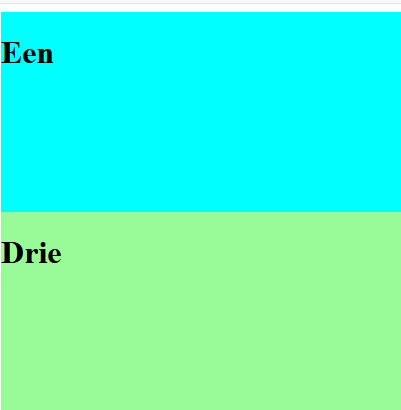
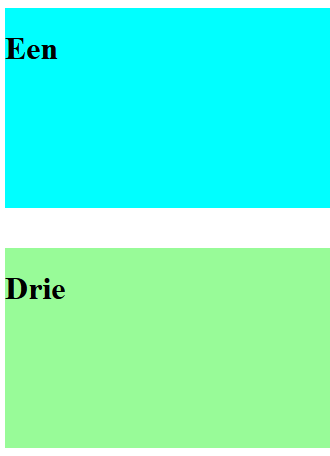
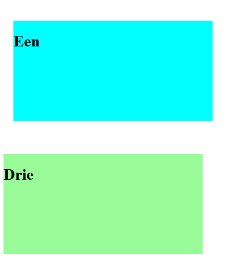
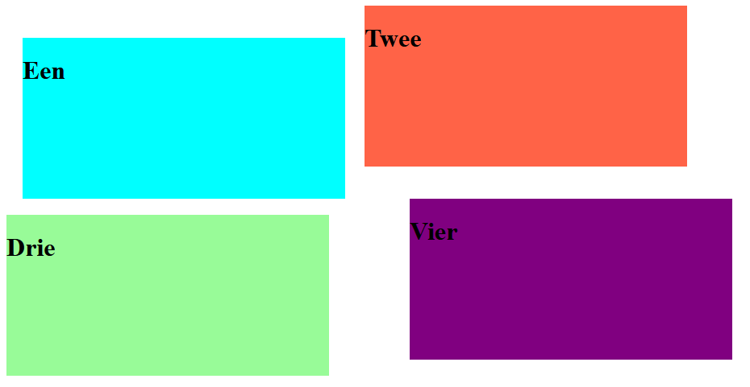

# FRONTEND-ESSENTIALS

## CSS BOX MODEL

## taak02 - Margin call

### Introductie

Weet je nog dat alle HTML elementen (tags) uit blokken bestaan. In deze taak leer je dat je de ruimte tussen die blokken, die __tags__ kunt aanpassen, kunt beïnvloeden.

Je kunt de ruimte tussen twee HTML-elementen op de volgende manier aanpassen:

```css

    #element2{
        margin-top:15px;
    }

```

Probeer het maar eens in het bestand `margin.html`. Voeg bovenstaande code toe en kijk wat er gebeurt.

Je kunt de `top`, `right`, `bottom`, `left` die bij 02-Layout besproken zijn ook hier toepassen.

Stel je hebt deze HTML-elementen onder elkaar staan:



en je wilt tussen deze `<div>`-elementen ruimte aanbrengen dan kan je dat als volgt doen:

```css
#div1{
    margin-bottom: 40px;
}
```

Dan krijg je dit



De eerste div krijgt een margin aan de onderkant (bottom) van 40 pixels.

Zo kan je ook aan de rechterkant (right), de bovenkant (top) en de linkerkant (left) ruimte aanbrengen. Dat zou je zo kunnen doen:

```css

#div1{
    margin-top: 40px;
    margin-right: 4px;
    margin-bottom: 67px;
    margin-left: 20px;
}

```

Dan krijg je dit:



Overal is ruimte ontstaan.

### Opdracht

1. Maak gebruik van index.html
2. Gebruik alleen `margin-top`,  `margin-right`, `margin-bottom` en `margin-left`
3. Probeer eens onderstaand eindresultaat te coderen met alleen de bij `2.`  genoemde css properties.

### Eindresultaat


