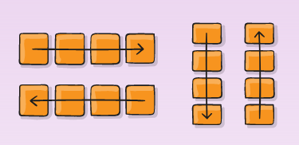
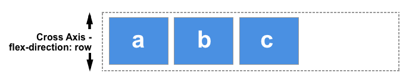
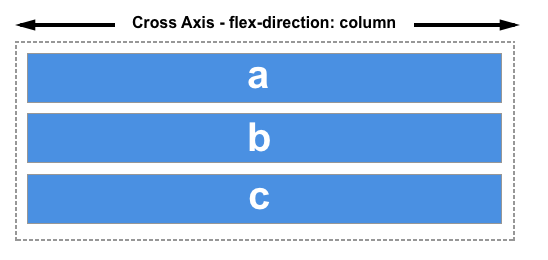
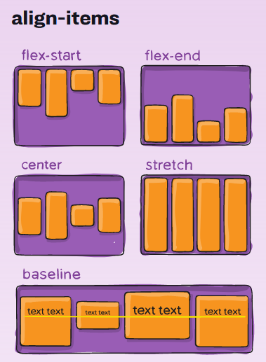

# FRONTEND-ESSENTIALS

## FlexBox

## taak03 - Align Items

### Introductie

Ok. Je hebt geleerd hoe je de hoofd-as van een flexbox-container kunt wijzigen:

Maar bedenk eens dat je een streep kunt zetten, 90 graden, door de hoofd-as heen. Dit noemen ze de kruis-as (cross-axis). Dit is een denkbeeldige lijn die 90 graden staat op de hoofdas.

In andere woorden:

Als `flex-direction: row;` dan geldt dit voor de __hoofd-as__: van links naar rechts
  
Maar de __kruis-as__ (cross-axis) loopt van boven naar beneden:

En andersom geldt natuurlijk ook: Als de hoofd-as loopt van boven naar beneden, dan is de kruis-as van links naar rechts.

### Opdracht

1. Open eens align-items.html en bekijk eens wat je ziet. Je ziet dat de blokken de gehele ruimte in beslag nemen. Dit komt omdat we de container groter hebben gemaakt met `width:100vh;`.
2. Als je nu `align-items:center;` toevoegd aan de container, wat gebeurt er dan?
3. De blokken gaan naar het midden toe van de kruis-as
4. Probeer het ook eens met de andere waarden:
   
5. Lees de bronnen nog eens door.

### Bronnen

- [CSS Flexbox Tutorial #10 - Align Items on the Cross Axis](https://www.youtube.com/watch?v=WY2itpeUK7Q)
- [A Complete Guide to Flexbox](https://css-tricks.com/snippets/css/a-guide-to-flexbox/)
- [Basic concepts of flexbox](https://developer.mozilla.org/en-US/docs/Web/CSS/CSS_Flexible_Box_Layout/Basic_Concepts_of_Flexbox)
