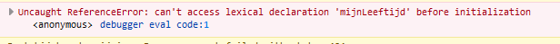

# FRONTEND-ESSENTIALS

## Javascript

## taak07 - To let or not to let

### Introductie

Bij Frontend Basic heb je te maken gehad met variabelen. Oh wacht eens even.. bij deze module ook...We gaan nog een principe van variabelen doornemen.

Een belangrijk principe is het declareren:

```js
let mijnVoornaam = "Bart";
```

en het gebruiken:

```js
console.log(mijnVoornaam);
```

Maar stel nou eens dat de waarde van een variabele veranderd:

```js
let mijnLeeftijd = 16;
mijnLeeftijd = 17;
console.log(mijnLeeftijd);
```

Het getal 16 in dit voorbeeld bestaat niet meer. De variabele heeft een nieuwe waarde: 17.

Andersom dat zou niet kunnen want de variabele is nog niet gedeclareerd:

```js
mijnLeeftijd = 17;
let mijnLeeftijd = 16;
```



Simpele regels, toch. Ok hier komt er nog een:

> Alles aan de rechterkant van het `=`-teken stop je als waarde in de variabele

Stel je hebt de volgende code, een berekening. ( ja! je kunt rekenen met Javascript!! )

```js
let kleinGetal = 2;
let groterGetal = kleinGetal + kleinGetal;
```

Wat zou de waarde van `groterGetal` zijn......? Met een beetje logisch nadenken kom je er wel..... ja inderdaad...4. Je telt eerst alles aan de rechterkant op en dan pas stop je het in de variabele.

Nog eentje:

```js
let grootGetal = 2000;
grootGetal = grootGetal + grootGetal;
```

Er is nu geen nieuwe variabele gemaakt. Wat denk je dat de _nieuwe_ waarde `grootGetal` is?

Inderdaad: 4000. Dezelfde regel geldt ook hier. Eerst alles optellen aan de rechterkant van het `=`-teken om daarna alles in dezelfde variabele te stoppen.

Ok, laatste vraag. Wat denk je dat de waarde van `laatsteGetal` is:

```js
let grootGetal = 1995;
let laatsteGetal = 5;
grootGetal = laatsteGetal + grootGetal;
laatsteGetal = grootGetal + 20;
```

Het antwoord krijg je niet. Bespreek deze vraag eventueel met je klasgenoten.

### Opdracht

1. Maak een index.html met de gebruikelijke tags en daarbij ook een script tag. (je kunt de index.html van taak01 nemen ;)
2. Maak een variabele `codingIsCool` en geef deze een boolean waarde
3. Op de volgende regel geef je dezelfde variabele de andere boolean waarde
4. console.log dit alles zodat je het resultaat kunt bekijken
5. Maak nog twee variabele: `huidigJaartal` en `geboorteJaar`
6. Geef de variabelen waardes.
7. Maak nog een variabele `mijnLeeftijd`
8. Bereken je leeftijd met deze drie laatste variabelen en console.log dat in je browser. (gebruik een min-teken `-` om deze berekening uit te voeren.)

### Bronnen

- [Programmeren in Javascript/Variabelen](https://nl.wikibooks.org/wiki/Programmeren_in_JavaScript/Variabelen)
- [JavaScript.com | Variables](https://www.javascript.com/learn/variables)
  